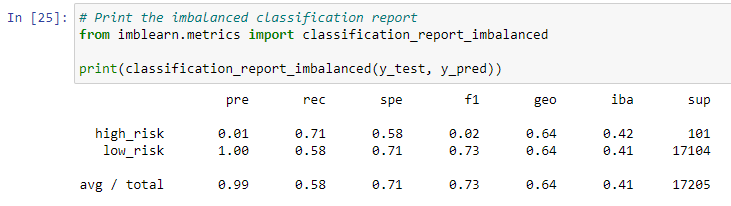

# Credit_Risk_Analysis

## Overview of the Analysis
The purpose of this analysis is to evaluate the performance of various machine learning models in predicting credit risk. The goal is to identify the model that provides the most accurate predictions, enabling lenders to make informed decisions and mitigate potential risks associated with loan default.

## Results
The following are the results of the machine learning models used in this analysis:

1. Naive Random Oversampling (RandomOverSampler):

  
Naive Random Oversampling (RandomOverSampler)

  

   - Balanced Accuracy Score: 0.6463970560994359
   - Precision (High Risk): 0.01
   - Precision (Low Risk): 1.00
   - Recall (High Risk): 0.71
   - Recall (Low Risk): 0.58

2. SMOTE Oversampling (SMOTE):
   - Balanced Accuracy Score: 0.658623076994322
   - Precision (High Risk): 0.01
   - Precision (Low Risk): 1.00
   - Recall (High Risk): 0.63
   - Recall (Low Risk): 0.68

3. Undersampling (ClusterCentroids):
   - Balanced Accuracy Score: 0.5442369453268994
   - Precision (High Risk): 0.01
   - Precision (Low Risk): 1.00
   - Recall (High Risk): 0.69
   - Recall (Low Risk): 0.40

4. Combination Sampling (SMOTEENN):
   - Balanced Accuracy Score: 0.6361059077142514
   - Precision (High Risk): 0.01
   - Precision (Low Risk): 1.00
   - Recall (High Risk): 0.68
   - Recall (Low Risk): 0.59

5. Balanced Random Forest Classifier:
   - Balanced Accuracy Score: 0.7885466545953005
   - Precision (High Risk): 0.03
   - Precision (Low Risk): 1.00
   - Recall (High Risk): 0.70
   - Recall (Low Risk): 0.87

6. Easy Ensemble AdaBoost Classifier:
   - Balanced Accuracy Score: 0.9316600714093861
   - Precision (High Risk): 0.09
   - Precision (Low Risk): 1.00
   - Recall (High Risk): 0.92
   - Recall (Low Risk): 0.94

## Summary
Based on the results, the Easy Ensemble AdaBoost Classifier stands out as the best performing model. It achieved the highest balanced accuracy score of 0.932 and demonstrated a precision of 0.09 for high-risk loans and 1.00 for low-risk loans. Additionally, it showed a recall of 0.92 for high-risk loans and 0.94 for low-risk loans. This indicates that the Easy Ensemble AdaBoost Classifier has a strong ability to both identify and capture a high proportion of high-risk and low-risk loans accurately.

In comparison, the ClusterCentroids undersampling model performed the worst among the six models, with a balanced accuracy score of 0.544 and recall values of 0.69 for high-risk loans and 0.40 for low-risk loans. The Easy Ensemble AdaBoost Classifier outperformed the ClusterCentroids model in terms of balanced accuracy by a significant margin of 0.388 and demonstrated much higher recall rates for both high-risk and low-risk loans.

Considering the high balanced accuracy score, precision, and recall for both high-risk and low-risk loans, the Easy Ensemble AdaBoost Classifier is recommended for predicting credit risk. Its robust performance in correctly identifying high-risk loans and capturing a significant portion of both high-risk and low-risk loans makes it a valuable tool for lenders in making informed decisions while minimizing potential risks.
